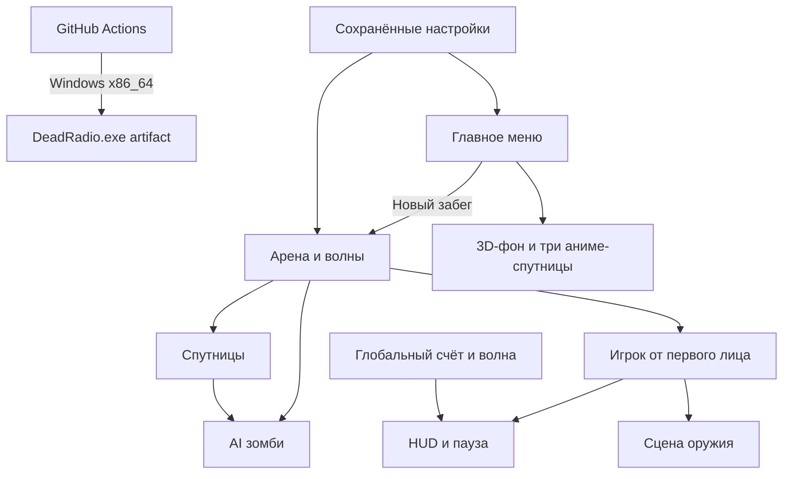

# Архитектура Dead Radio

## Слои

- **UI:** `main_menu.gd` строит главное меню и настройки; `hud.gd` отображает состояние забега, паузу и поражение.
- **Игровая логика:** `arena.gd` создаёт освещение/укрытия и управляет волнами. `player.gd`, `zombie.gd` и `companion.gd` отвечают за движение и действия своих персонажей.
- **Персонажи и оружие:** `anime_survivor.gd` создаёт стилизованные 3D-модели; `rifle.tscn` и `rifle.gd` изолируют вид оружия, отдачу и вспышку.
- **Автозагрузки:** `GameManager` хранит счёт/убийства/волну; `GameSettings` сохраняет звук, разрешение, режим окна, VSync и чувствительность в `user://dead_radio_settings.cfg`.
- **Контент:** WAV/PNG хранятся в `assets/audio/packs/` и `assets/textures/packs/`; игра не загружает ресурсы из сети.
- **Сборка:** `.github/workflows/build-windows.yml` импортирует ресурсы, экспортирует preset `Windows Desktop` и публикует `.exe` как Actions artifact.
